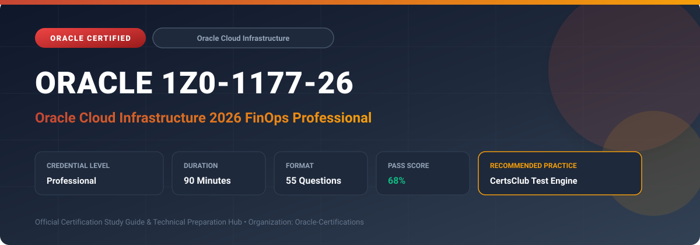

  

# Oracle 1Z0-1177-26: Oracle Cloud Infrastructure 2026 FinOps Professional

---

## 1. Exam Overview & Candidate Profile

The **Oracle 1Z0-1177-26: Oracle Cloud Infrastructure 2026 FinOps Professional** credential certifies professionals who demonstrate technical mastery, architectural competence, and hands-on operational capability in this certification domain.

Candidates validate comprehensive knowledge and expertise required to design, configure, manage, and optimize mission-critical Oracle environments across cloud, on-premises, and hybrid architectures.

### Target Audience & Prerequisites
- **Target Roles**: Implementation Specialists, Cloud Architects, Technical Leads, Enterprise Consultants, and Systems Engineers.
- **Recommended Experience**: 1–2 years of practical, hands-on experience designing, implementing, and maintaining corresponding Oracle solutions.
- **Credential Earned**: Professional Certification.

---

## 2. Key Exam Specifications

| Specification | Details |
| :--- | :--- |
| **Exam Code** | **Oracle 1Z0-1177-26** |
| **Official Title** | Oracle Cloud Infrastructure 2026 FinOps Professional |
| **Certification Track** | Oracle Cloud Infrastructure |
| **Exam Duration** | 90 Minutes |
| **Number of Questions** | 55 Questions |
| **Passing Score** | 68% |
| **Question Format** | Multiple Choice (Single/Multiple Answer), Scenario-Based Questions |
| **Delivery Provider** | Oracle University / Pearson VUE (Online Proctored or Test Center) |
| **Recommended Practice Engine** | [CertsClub Oracle Practice Tests](https://www.certsclub.com/oracle/1z0-1177-26-dumps.html) |

---

## 3. Official Blueprint & Exam Domain Breakdown

The examination assesses candidate competencies across core functional domains weighted as follows:

| Domain Area | Weighting |
| :--- | :--- |
| **OCI Pricing Models, Universal Credits & Annual Commitments** | `25%` |
| **Cost Analysis, Reporting, Invoicing & Cost Tracking Tags** | `25%` |
| **Compartment Budgets, Quota Policies & Alert Rules** | `20%` |
| **Cloud Resource Optimization, Rightsizing & Cloud Advisor** | `15%` |
| **FinOps Framework Culture, Chargeback & Showback Governance** | `15%` |

---

## 4. Deep Dive into Complex & Challenging Technical Topics

To secure a passing score on the 1Z0-1177-26 exam, candidates must master the following advanced concepts:

- Mastering OCI Universal Credits (UCM), Pay-As-You-Go (PAYG), Annual Commitments, and Support Rewards calculations.
- Creating customized Cost Analysis charts, filtering by service, compartment, region, and Defined Cost Tracking Tags.
- Generating automated daily usage reports, cost reports, and integrating billing data into external BI tools via Object Storage exports.
- Configuring Compartment Budgets with actual vs forecasted spending threshold alerts routed through OCI Notifications.
- Executing FinOps optimization routines: identifying idle compute, rightsizing oversized shapes, utilizing Burstable VMs, and deleting detached block volumes.

---

## 5. Scenario-Based Demo & Practice Questions

### Question 1
Which OCI program rewards enterprises for every dollar spent on OCI workloads by giving them discount credits that offset on-premises Oracle technology software licensing support fees?

A) Oracle Support Rewards
B) Oracle FastConnect Allowance
C) Universal Compute Dividend
D) Free Tier Perpetual Credit

- **Correct Answer**: `A) Oracle Support Rewards`  
- **Technical Explanation**: Oracle Support Rewards allows customers with Universal Credits agreements to earn rewards that can be applied to pay on-premises Oracle Software update license support bills.

---

### Question 2
How can an enterprise ensure that cloud spending is accurately attributed to distinct internal business units and departments for financial chargeback?

A) Enforce Defined Cost-Tracking Tags on all created cloud resources.
B) Create a separate OCI root tenancy for every individual employee.
C) Disable all budget alerts across all compartments.
D) Manually inspect physical server serial numbers.

- **Correct Answer**: `A) Enforce Defined Cost-Tracking Tags on all created cloud resources.`  
- **Technical Explanation**: Cost-tracking tags are specialized defined tags that OCI injects into detailed cost and usage reports, enabling precise chargeback and showback by department, project, or environment.

---

## 6. Recommended Preparation Strategy & Practice Testing Engine

Achieving certification in **Oracle 1Z0-1177-26** requires balanced theoretical study and scenario-based simulation practice:

1. **Review Oracle Documentation**: Master architecture guides, implementation workbooks, and administration manuals on the Oracle Help Center.
2. **Hands-on Lab Practice**: Execute real-world configuration, policy setup, and troubleshooting tasks in your cloud tenancy or test instance.
3. **Simulated Exam Drills**: Practice answering timed, scenario-based multiple-choice questions to familiarize yourself with the question formats, traps, and timing constraints.

### Practice With CertsClub
For realistic practice questions, updated dumps, and mock testing environments:
- **Resource**: [CertsClub Oracle Practice Test Engine](https://www.certsclub.com/oracle/1z0-1177-26-dumps.html)
- **Special Discount**: Use coupon code **`club20`** during checkout for an instant **20% discount** on all practice exam bundles and testing engines.

---

## 7. Official Documentation & References

- [Oracle University Certification Registry](https://education.oracle.com/)
- [Oracle Help Center Documentation Portal](https://docs.oracle.com/)
- [Oracle Cloud Infrastructure & Applications Guides](https://docs.oracle.com/en/cloud/)
- [CertsClub Oracle Certification Exam Practice](https://www.certsclub.com/oracle/1z0-1177-26-dumps.html)

---

## 8. SEO & Discovery Keywords

`oracle 1z0-1177-26, oracle 1z0-1177-26 exam, oracle 1z0-1177-26 dumps, 1Z0-1177-26 practice questions, 1Z0-1177-26 study guide, oci 2026 finops professional, certsclub 1z0-1177-26`